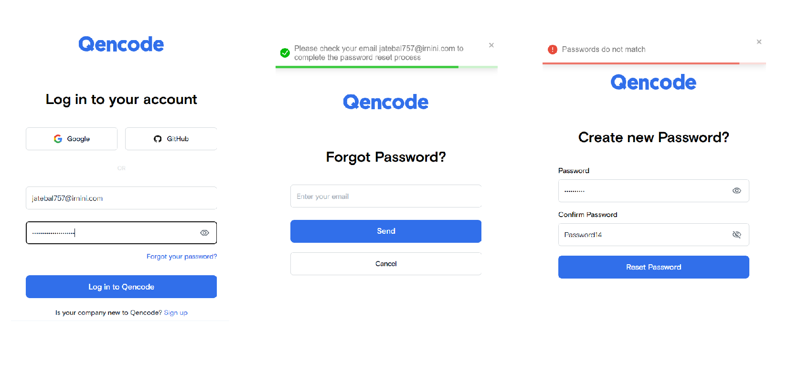

# Test "Login interface"

# Running the React Application

1. Before getting started, make sure you have Node.js installed on your computer.
2. In the terminal, navigate to your project directory and run the following command to install dependencies:
  `npm install`
3. Start the Development Server: After installing dependencies, start the development server by running the command:
  `npm dev`
4. This will launch the application on a local development server. Open your web browser and navigate to http://localhost:3000 to see your application in action.
5. Build for Production: To build your application for production, run the command:
  `npm run build`. This process will create an optimized version of your application ready for deployment on a server.

# React + Vite

This template provides a minimal setup to get React working in Vite with HMR and some ESLint rules.
Currently, two official plugins are available:
- [@vitejs/plugin-react](https://github.com/vitejs/vite-plugin-react/blob/main/packages/plugin-react/README.md) uses [Babel](https://babeljs.io/) for Fast Refresh
- [@vitejs/plugin-react-swc](https://github.com/vitejs/vite-plugin-react-swc) uses [SWC](https://swc.rs/) for Fast Refresh